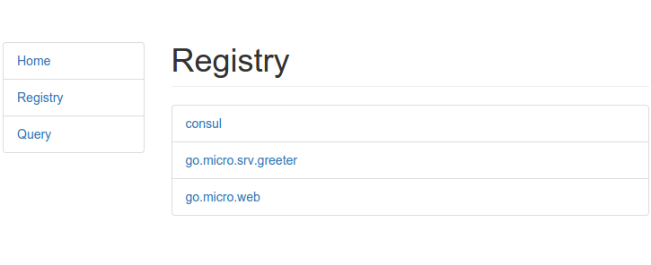
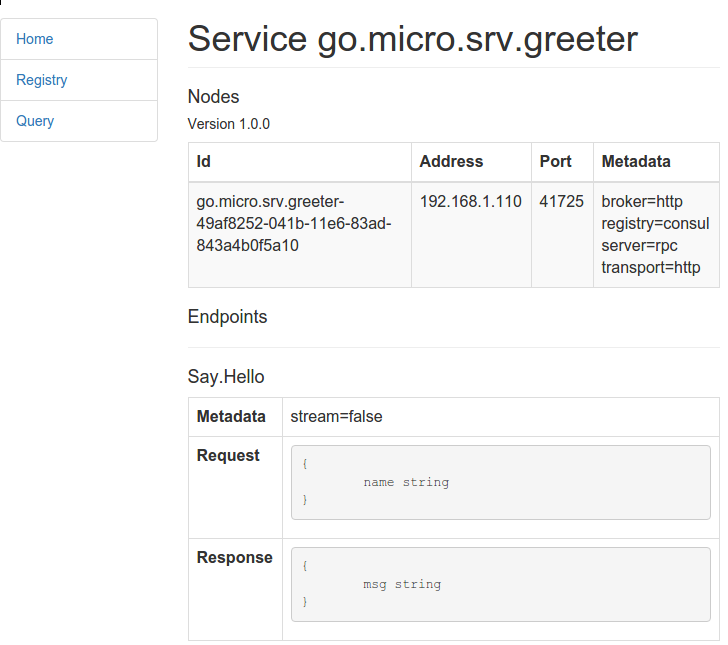

# micro-demo

Demo of [Micro](https://github.com/micro/micro), A microservice toolkit.

Setup micro and consul
```
go get github.com/micro/micro
go get github.com/hashicorp/consul
consul agent -dev -advertise=127.0.0.1
```

Run an example micro service
```
go get github.com/micro/micro/examples/greeter/server
server
```

Run different micro commands
```
micro list services
micro get service go.micro.srv.greeter
micro query go.micro.srv.greeter Say.Hello '{"name": "John"}'
```

Web interfaces
* consul - http://localhost:8500/
* Micro - `micro web` - http://localhost:8082/



